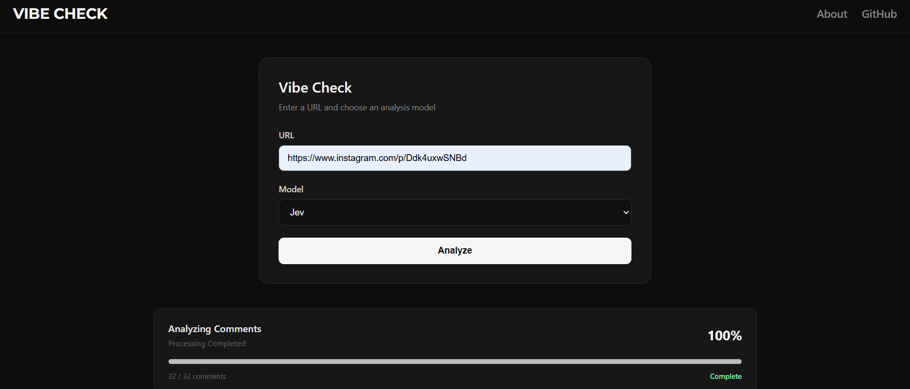
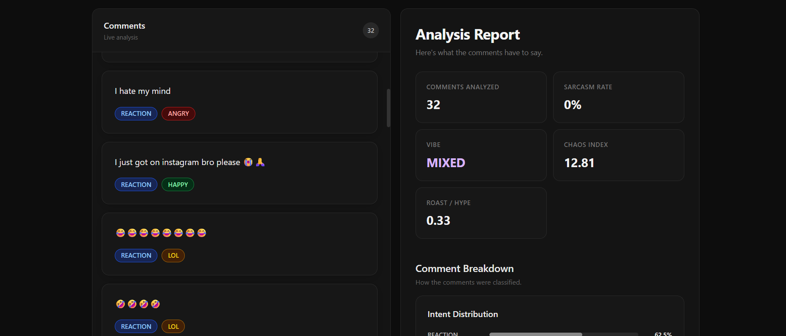

# 🔥 Vibe Check


[](https://vibe-check-jev.netlify.app/)


### AI-powered Instagram comment intelligence

**Vibe Check** turns an Instagram post/Reel URL into structured audience insights.

Paste a URL → fetch comments → analyze them with AI → watch results stream live → understand the overall "vibe" of the comment section.

> **Instagram URL → Comments → AI Analysis → Real-time Dashboard → Insights**

#### Try it out: https://vibe-check-jev.netlify.app/

Homepage


Result Section


---

## 🎯 Why Vibe Check?

Instagram has **3 billion+ monthly active users**, making comment sections a significant source of audience feedback. Yet hundreds of comments are difficult to interpret manually.

Vibe Check converts unstructured comments into structured signals such as:

- **Intent:** Hype, Roast, Joke, Question, Suggestion, Story, etc.
- **Reaction:** Happy, LOL, Angry, Confused, Flabbergasted, etc.
- **Sarcasm detection**
- **Vibe classification**
- **Chaos Index**
- **Roast / Hype ratio**

This makes it possible to go from **hundreds of individual comments to an overview of audience behavior in seconds.**

---

## ⚡ The Pipeline

```text
Instagram URL
      │
      ▼
┌─────────────────┐
│ Instagram API   │
│ Fetch Comments  │
└────────┬────────┘
         ▼
┌─────────────────┐
│ Comment Cache   │
└────────┬────────┘
         ▼
┌─────────────────────────┐
│ AI Analyzer              │
│ Jev / Laya / Mock        │
└────────┬────────────────┘
         │
         │ Server-Sent Events
         ▼
┌─────────────────┐
│ React Dashboard │
│ Live Results    │
└────────┬────────┘
         ▼
┌─────────────────┐
│ Aggregator      │
│ Vibe & Metrics  │
└─────────────────┘
```

### The interesting part

The application doesn't wait for every comment to finish processing.

The FastAPI backend streams individual analysis results to the React frontend using **Server-Sent Events (SSE)**.

So while 200 comments are being analyzed, the dashboard can progressively display:

```text
Analyzed: 127 / 200

██████████████░░░░░░

Latest:
🔥 HYPE       → "This is insane bro"
😂 LOL        → "bro really thought..."
😡 ANGRY      → "This makes no sense"
```

The final aggregate report is then generated from the complete analysis.

---

## 🧠 Structured AI Analysis

Instead of asking an LLM for a generic sentiment score, Vibe Check breaks analysis into explicit decisions.

For every comment:

```text
Intent       → HYPE / ROAST / JOKE / ...
Reaction     → HAPPY / LOL / ANGRY / ...
Sarcasm      → TRUE / FALSE
```

The analyzer is abstracted behind a common interface, allowing different implementations:

- **Jev** — TypeSafe's structured decision model
- **Laya** — alternative analyzer
- **Mock** — local development/testing

This makes the AI layer replaceable without rewriting the application.

---

## 🏗️ Tech Stack

| Layer | Technology |
|---|---|
| Frontend | React 19 + Vite |
| Backend | Python + FastAPI |
| AI | Jev / Laya |
| Instagram Data | RapidAPI |
| Streaming | Server-Sent Events |
| Validation | Pydantic |
| Caching | Filesystem JSON cache |
| Frontend Hosting | Netlify |

### Architecture

```text
React
  │
  │ HTTP + SSE
  ▼
FastAPI
  │
  ├── Instagram Service
  │       └── RapidAPI
  │
  ├── Analysis Service
  │       ├── Jev
  │       ├── Laya
  │       └── Mock
  │
  ├── Cache
  │       ├── Comments
  │       └── Analysis
  │
  └── Aggregator
          └── Analysis Report
```

---

## 💻 Engineering Highlights

This project demonstrates:

**Full-stack development**  
React frontend integrated with a Python/FastAPI backend.

**AI engineering**  
Structured multi-dimensional classification rather than simple prompt-based sentiment analysis.

**Real-time systems**  
SSE-based streaming from backend → browser.

**API integration**  
Instagram data ingestion through RapidAPI and AI inference through TypeSafe.

**Caching & efficiency**  
Instagram comments and AI results are cached to reduce unnecessary external API calls and repeated analysis.

**Software architecture**  
Analyzer abstraction allows multiple AI implementations to coexist behind the same interface.

**Data processing**  
Individual AI decisions are transformed into higher-level metrics and visualizations.

---

## 🚀 Run Locally

### 1. Clone

```bash
git clone https://github.com/ayaan0604/vibe-check.git
cd vibe-check
```

### 2. Backend

```bash
cd backend

python -m venv venv

# Windows
venv\Scripts\activate

pip install -r requirements.txt
```

Add your RapidAPI key to the backend environment:

```env
X_RAPIDAPI_KEY=your_rapidapi_key
```

Get the Instagram Scraper API key from:

https://rapidapi.com/thetechguy32744/api/instagram-scraper-stable-api/

For real AI analysis, configure your **Jev / TypeSafe** credentials.

If you don't have a Jev key, enable the built-in mock analyzer:

```python
# backend/services.py

self.mock_active = True
```

Start the API:

```bash
uvicorn main:app --reload
```

Backend:

```text
http://localhost:8000
```

API docs:

```text
http://localhost:8000/docs
```

### 3. Frontend

In another terminal:

```bash
cd frontend
npm install
npm run dev
```

Open the Vite URL shown in the terminal.

---

## 🔑 API Keys

### Instagram

RapidAPI provides the Instagram Scraper API used to retrieve comments.

**Free development access:** currently available with limited requests depending on the RapidAPI plan.

### Jev

Jev is provided through TypeSafe AI and requires a paid account.

If Jev is unavailable, the project can run using the *Laya Model* locally, or use the provided mock analyzer.

---

## 📌 Project in One Sentence

> **Vibe Check is a full-stack AI application that transforms an Instagram comment section into real-time, structured audience intelligence using FastAPI, React, streaming, caching, and interchangeable AI analyzers.**

---

## 👨‍💻 Author

**Ayaan**

[GitHub](https://github.com/ayaan0604)

**Repository:**  
https://github.com/ayaan0604/vibe-check